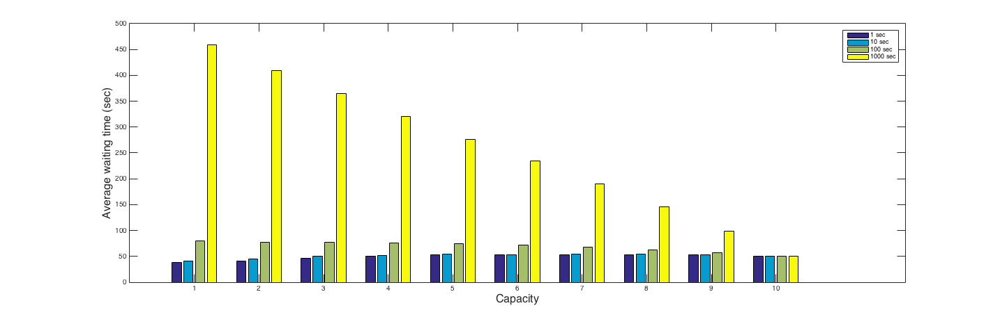

# <center> Parallel Programming </center>

### <center> [HW2] 102062111 林致民 </center>

## Machine 

由於這次的電腦可以不用跨node，因此我在自己的電腦上跑，以下是規格：

#### 10 cores 20 threads 的 CPU兩顆，共40 threads

```c
processor	: 39
vendor_id	: GenuineIntel
cpu family	: 6
model		: 62
model name	: Intel(R) Xeon(R) CPU E5-2648L v2 @ 1.90GHz
stepping	: 4
microcode	: 0x428
cpu MHz		: 1200.000
cache size	: 25600 KB
physical id	: 1
siblings	: 20
core id		: 12
cpu cores	: 10
apicid		: 57
initial apicid	: 57
fpu		: yes
fpu_exception	: yes
cpuid level	: 13
wp		: yes
flags		: 	fpu vme de pse tsc msr pae mce cx8 apic sep mtrr pge 
			 	mca cmov pat pse36 clflush dts acpi mmx fxsr sse sse2
			 	ss ht tm pbe syscall nx pdpe1gb rdtscp lm constant_tsc 
			 	arch_perfmon pebs bts rep_good nopl xtopology 
			 	nonstop_tsc aperfmperf eagerfpu pni pclmulqdq dtes64 
			 	monitor ds_cpl vmx smx est tm2 ssse3 cx16 xtpr pdcm pcid dca 
			 	sse4_1 sse4_2 x2apic popcnt tsc_deadline_timer aes xsave avx 
			 	f16c rdrand lahf_lm ida arat epb xsaveopt pln pts dtherm 
			 	tpr_shadow vnmi flexpriority ept vpid fsgsbase smep erms
bogomips	: 3801.70
clflush size	: 64
cache_alignment	: 64
address sizes	: 46 bits physical, 48 bits virtual
power management:
```

## Implementation of Barnes-Hut algorithm

### 實作 Barnes-Hut algorithm

1. 首先，我們知道每一次切割，最多都會切成四等分，假設在某一個等分裡面還有 > 1個body，那麼再繼續往下切，每一次切割，就是一個child。既然一開始最多可以切成四等分，那麼我就假設最初切割時會有四個block產生，這時候我可以把thread分配給這四個block，然後讓thread繼續延切割、延展下去。

2. 首先我的thread最主要分成兩個部分：繪圖用Thread(1個) & 計算用Thread(其他個數）， 這裡的問題討論重點會放在計算用Thread。假設我當前狀態已經把樹建好了，我有N個body、 t個threads可以使用。如果要求出一個body的合力加速度，必須要traverse build好的tree。現在有N個body需要求出他的合力加速度，那麼我就把t個threads分配給 N 個，只要一個threads做完馬上去做其他body的合力加速度，直到算完每個body的合力加速度為止。

3. 這次有synchronization的部分在於「輸出到螢幕上」和「對一個值assign」，由於必須要把網格輸出到螢幕上，所以需要traverse一整棵tree才可以知道哪些block要切割。但是traverse的過程中，有可能在traverse的途中被已經做完task的其他thread delete(free)掉，導致找不到位置。由於我這個程式是用openMP寫出來的，OpenMP又是從pthread implement出來的，因此我直接使用pthread的mutex lock去保護tree，像是建立一棵tree的時候也不能同時traverse。至於node的synchronize，其實有發現到synchronize對於nbody好像不是那麼的重要，不過由於對body的值（位置、速度）的運算並不是原子操作（atomic operation)，所已有可能在讀取前半段的值時，這個值被概調，這件事情是有可能會發生的。但是依照我的觀察，多一些lock的機制在node的讀寫上會明顯降低效能，但是結果卻不會改變太多。

4. 首先是資料結構的設計，由於一開始寫程式的時候為了求方便以及好擴充，我把資料結構設計的非常物件導向，因此function call所造成的時間延遲是非常嚴重的。跨function 的 optimization 對compiler來說是比較困難的，在這部分我把大量重複呼叫的function全部改成inline，藉由compiler 把inline function的內容展開，這時候compiler能夠做的optimization就變多了，對於原本不敢做、有可能會對code造成傷害的optimization都可以做了，這時候不僅僅是省下stack frame所佔用的記憶體空間，也可以重複對相同區塊的記憶體，理論上是可以減少cache miss，然後讓效能提升，再加上compiler optimization(目前求方便，直接下-O3)，消滅大量不用的instruction。e.g. 展開loop，把變數用常數換掉、define 大量物理公式的macro，保留很多相同的算式，compiler的optimization可以幫我把這些等式換掉（通常會塞進一個變數，再讓變數把其他相同的等式換掉）。其實大部分的編程都是針對compiler所做的排列，不少方法都可以增進效能，也可以處理更大量的資料。以我做出來的結果來說，這些optimization讓我從要執行30秒的程式優化到只要執行1秒。


## Performance analysis of Single Roller Coaster Car Problem

(以下都是以 n = 10, N = 1000 為固定值跑出來的實驗，passenger的閒晃時間為 uniform distribution 機率分布生產出來的random number)
 
### 相同Capacity不同Car running time 比較
當capacity變大的時候，會發現到average running time 會下降。而且相同capacity，當car running的時間變長之後，average waiting time也會上升。
 

### 相同Car runnning time 不同Capacity比較
當Car running time 變大的時候，average waiting time也會跟著變大。當相同的waiting time，會發現到1, 10 car running time 會因為car capacity而增大，但是在 100, 1000 car running time 則會因為capacity 增大而減少。


## Performance analysis for nbody


### Strong scalability 
以下的測試資料參數樣版：`{threads} 1 200 1 test4.txt 0.1/1 disable -1 -1 2.5 500` 


### Weak scalability
以下的測試資料參數樣版：`40 1 1000 1 test4.txt 0.1/1 disable -1 -1 2.5 500` 


以下的測試資料參數樣版：`1 1 200 1 {input testcase} 0.1/1 disable -1 -1 2.5 500` 


### 對BH Algorithm 調整不同theta，比較IO, Build tree, compute time

以下的測試資料參數樣版：`40 1 200 1 test4.txt {theta} disable -1 -1 2.5 500`


下面這張是把較不明顯的IO, Build time 畫出來


## Experience

覺得科學計算很麻煩，有時候出現錯誤不知道該如何找起，不知道是自己的公式導錯，還是程式碼寫錯。然後一直跑不出跟助教相似的圖形，而且效能也沒有像助教那樣的高，不過到最後tune完其實還滿接近助教的執行速度，只是還有進步的空間。