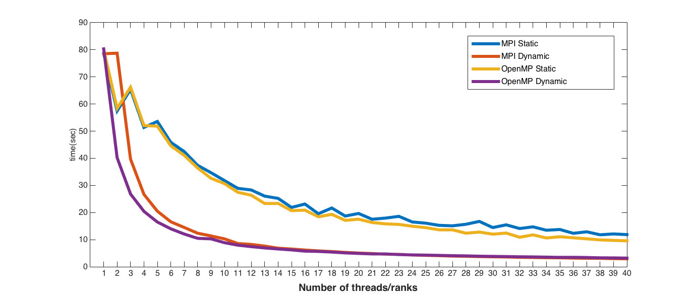

# <center> [HW3] Parallel Programming </center> 

### <center> 102062111 林致民 </center>

## Design
Static & Dynamic 之間最大的差異是，前者會固定負責data的某個區段，後者則是讓空閒的thread/process去做還沒有完成的工作。接下來以下三種不同平行方法都會根據這規則去實作。

1. MPI
	* Static：以下pseudocode是我切割資料的方式
		
		```cpp
		int numPerTask = width / (size);  // 切割width
    	if (rank == size - 1)             // 如果是最後一個rank
           numPerTask += width % (size); // 把沒切完的width分給那個rank
		```
		切完資料後，各自的rank把 $numPerTask \times height$個點的結果算出來，之後把所有的結果送回`Rank0`，讓Rank0把算好的結果印出來。
		
	* Dynamic：切割資料的方式跟Static一樣，從width開始分配。假設有兩個以上的Rank，採用 Master Slave 的方式，讓`Rank 0` 負責分配工作給其他的Rank。分配的方法如下：
		1. Slave 向 Master 發一個要資料的request
		2. `Rank 0` 開始做Round Robin，如果發現當前有其他的Slave正在向Master提交運算工作，而且還有沒有分配出去的資料（width number)，`Rank 0`會把當前沒做的運算資料分配給Request。反之，如果都已經做完了，Master會傳一個非法值（ -1 ) 給Slave
		3. 假設Slave拿到的是合法的Width number，就會開始計算，計算完回到`(1)`。如果拿到的是非法的Width Number，那麼就把計算結果回傳給Master，並且結束這個slave的執行緒。

2. OpenMP
	* Static : OpenMP會幫我們把資料依照thread的數量，平均分配給這些thread
		
        ```cpp
        #pragma omp parallel num_threads(threads) private(i, j)
        {
            #pragma omp for schedule(static)
            for(i=0; i<width; i++) {
                for(j=0; j<height; j++) {
            	   ............
            	   ............
                }
            }
            ........
            ........
        }
        ```
        使用OpenMP提供的`for schedule`來幫助我們實作static version
    * Dynamic : 以下是OpenMP使用Dynamic scheduling的方法，假設某個thread當前有空閒的話，他會去做當前還有做的任務
		
        ```cpp
        #pragma omp parallel num_threads(threads) private(i, j)
        {
            #pragma omp for schedule(dynamic, 1)
            for(i=0; i<width; i++) {
                for(j=0; j<height; j++) {
            	   ............
                }
            }
            ........
        }
        ```
3. Hybrid
    * Static：MPI+OpenMP static混和版本，把width平均分配給其他的rank，然後再把height平分給rank create出來的thread，以下是pseudocode：
        
        ```cpp
        int numPerTask = width / (size);  // 切割width
        if (rank == size - 1)             // 如果是最後一個rank
           numPerTask += width % (size); // 把沒切完的width分給那個rank
        
        int beginPos = rank * numPerTask;   // 當前rank的起點（資料切割後的起點）
        for(int i = beginPos; i < beginPos + numPerTask; i++) {
            #pragma omp parallel num_threads(threads) private(j)
            {
                #pragma omp for schedule(static)    // OpenMP Static schedule
                for(j=0; j<height; j++) {
                    ....
                }
            }
            ...
        }
        ```
    * Dynamic：MPI+OpenMP Dynamic 混和版本，只要從Master接收到合法的width number，再對Height做Dynamic scheduling，以下是pseudocode：
        
        ```cpp
        i = WAIT_AND_RECEIVE_FROM_MASTER();  // receive task from Master
        while (i != -1) {   // If i is valid ...
            int j;
            #pragma omp parallel num_threads(threads) private(j)
            {
                #pragma omp for schdule(dynamic, 1) // Shared memory dynamic scheduling ....
                for (j = 0; j < height; ++j) {  
                    ...
                }
            }
            i = WAIT_AND_RECEIVE_FROM_MASTER();
        }
        ```
        
在這次的實驗，發現到單純把資料切的平均，對於執行時間的減少沒有太大的幫助，底下有更切確的分析。這次有些資料區間需要大量的運算，如果把資料平均分配，勢必有些thread/rank需要做比較久，Dynamic則是當有空閒時，就會去搶工作，這樣就可以把一些比較複雜的運算平分掉了。

## Performance analysis

### Strong scalability
這個實驗是用自己的機器跑得，規格如下：

```bash
CPU : Intel(R) Xeon(R) CPU E5-2648L v2 @ 1.90GHz x 2
      10 cores 20 threads) x 2 = (20 cores 40 threads 
Memory : 128 GB
Storage : 500 GB
Operating System : Ubuntu 12.04 LTS, Linux 3.11.0-26-generic
Compiler : gcc-4.8
MPI : openmpi-1.5
``` 

固定 N = 3000 的條件下，只變動thread(rank)個數，觀察執行時間的變化，{MPI, OpenMP} x {static, dynamic}：



普遍 Static 跑起來比Dynamic還慢的原因，我猜測是因為testcase的某個區段需要大量的運算時間，如果只是固定切割，那麼可能會有某個rank/thread需要做比較多的是情，這樣一來就算其他thread/rank早就做完了，還是在等這個rank/thread做完，導致整個程式的執行時間卡在那裡。不過還有發現到一個神奇的點，MPI or OpenMP的`Static version`在thread/rank > 13之後，會發現到「偶數 ---> 奇數個 rank/size」的執行時間會增加，猜測是剛好偶數被分配到的運算量比較多，執行時間就相對的久。

### Weak Scalability

這個實驗是固定thread * rank的數目，觀察當Problem size(N)增加的時候，執行時間的變化是如何。

以下是實驗設定，把 $process \times threads\_per\_process$ 固定在12 ：

* MPI：process = 12, 1 threads per process
* OpenMP：process = 1, 12 threads per process
* Hybrid : {node = 3}, {process = 2, 2 threads per process}

