# <center> Parallel Programming </center>

### <center> [HW4] 102062111 林致民 </center>

## Implementation

1. 首先把資料以 $B \times B$ 作為一個block切割，然後以固定threads個數去分配這些block，如下圖： 

    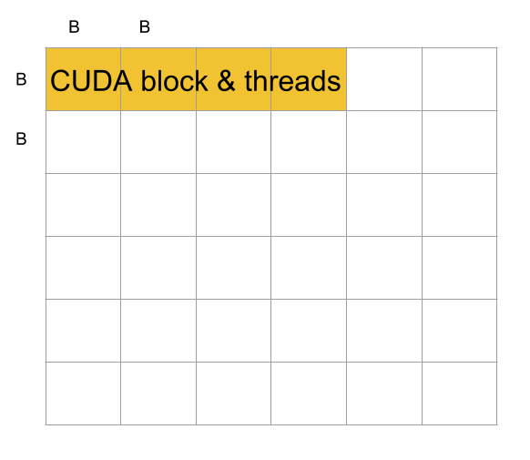 
    
    假設黃色的部分之間沒有dependence，這個部分是一次CUDA kernel launch 固定做的範圍，單位時間最多可以同時運算的數量。
    
    再來是Multi-GPU資料切割的方式，我只有在phase 3的時候把資料切成兩半（因為我們只有兩張卡），分別丟到不同的GPU上，做完之後再互相交換彼此的運算結果，下圖是示意圖： 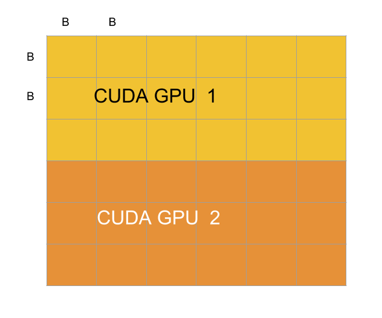
    
    
    
2. Multi-GPU 的implement方式則跟single GPU不太一樣，由於在做的時候發現phase one & two 其實影響整個跑分不大，大部分匯集中在phase 3，所以phase one & two 我讓各自的GPU自己算自己的，phase 3才把資料切給不同的GPU做。至於兩個GPU互相溝通的方式，由於使用的API不同，我分成openmp 以及 MPI 不同的方法來說明

    * OpenMP : 使用`cudaMemcpy(gpu[0], gpu[1], count, cudaDeviceToDevice)`，直接讓device與device之間傳輸資料就好了
    * MPI : 先把`GPU[0]` 上的資料copy到main memory，再透過MPI_Send/Recv 把資料送到另外一個rank，在另外一個rank把資料copy到`GPU[1]`上，`GPU[1]`到`GPU[0]`也是同樣的方法。

3. Configuration : 
    * B = `8 16 32 64 128 256 512 1024`
    * block = $1024 \times 1024$ 
    * threads = $8 \times 8$

## Experiment environment 

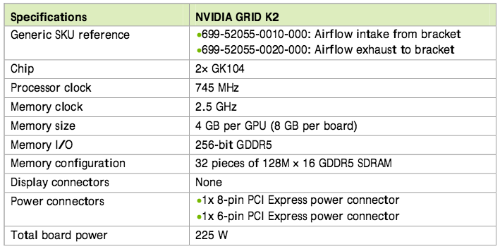

```bash
$ nvidia-smi
Sun Jan 10 20:12:22 2016
+------------------------------------------------------+
| NVIDIA-SMI 352.63     Driver Version: 352.63         |
|-------------------------------+----------------------+----------------------+
| GPU  Name        Persistence-M| Bus-Id        Disp.A | Volatile Uncorr. ECC |
| Fan  Temp  Perf  Pwr:Usage/Cap|         Memory-Usage | GPU-Util  Compute M. |
|===============================+======================+======================|
|   0  GRID K2             Off  | 0000:05:00.0     Off |                  Off |
| N/A   41C    P0    46W / 117W |     11MiB /  4095MiB |      0%      Default |
+-------------------------------+----------------------+----------------------+
|   1  GRID K2             Off  | 0000:06:00.0     Off |                  Off |
| N/A   38C    P0    38W / 117W |     11MiB /  4095MiB |      0%      Default |
+-------------------------------+----------------------+----------------------+
```

```bash
CPU : Intel(R) Xeon(R) CPU E5-2648L v2 @ 1.90GHz x 2
      10 cores 20 threads) x 2 = (20 cores 40 threads)
Memory : 128 GB
Storage : 500 GB 
Network : Ethernet 
Operating System : Ubuntu 12.04 LTS, Linux 3.11.0-26-generic
Compiler : gcc-4.8, CUDA 6.5
MPI : openmpi-1.5
``` 

## Profiling

### Single GPU

```bash
$ nvprof ./HW4_102062111_cuda testcase/5120.txt cuda.txt 256
==7356== Profiling result:
Time(%)      Time     Calls       Avg       Min       Max  Name
 99.76%  35.7972s    230400  155.37us  16.161us  446.94us  floyd_warshall(int*, int, int, int, int, int)
  0.12%  43.219ms         3  14.406ms  1.0560us  43.216ms  [CUDA memcpy HtoD]
  0.12%  41.666ms         1  41.666ms  41.666ms  41.666ms  [CUDA memcpy DtoH]

==7356== API calls:
Time(%)      Time     Calls       Avg       Min       Max  Name
 97.61%  35.1284s    230400  152.47us  8.7540us  5.0724ms  cudaLaunch
  0.97%  347.98ms   1382400     251ns     190ns  622.07us  cudaSetupArgument
  0.69%  248.64ms         4  62.159ms  9.5980us  204.90ms  cudaMemcpy
  0.33%  117.17ms         4  29.292ms  8.9300us  116.97ms  cudaMalloc
  0.22%  77.503ms    230406     336ns     277ns  615.26us  cudaGetLastError
  0.18%  66.163ms    230400     287ns     253ns  65.080us  cudaConfigureCall
  0.00%  830.96us       166  5.0050us     272ns  177.87us  cuDeviceGetAttribute
  0.00%  104.15us         2  52.077us  50.666us  53.488us  cuDeviceTotalMem
  0.00%  82.443us         2  41.221us  38.413us  44.030us  cuDeviceGetName
  0.00%  12.078us         1  12.078us  12.078us  12.078us  cudaSetDevice
  0.00%  3.7600us         2  1.8800us     402ns  3.3580us  cuDeviceGetCount
  0.00%  1.9750us         4     493ns     346ns     802ns  cuDeviceGet
```

### Multi-GPU-OpenMP

```bash
$ nvprof ./HW4_102062111_openmp testcase/5120.txt cuda.txt 256
==7631== Profiling result:
Time(%)      Time     Calls       Avg       Min       Max  Name
 98.55%  39.4087s    256000  153.94us  16.161us  446.65us  floyd_warshall(int*, int, int, int, int, int)
  0.75%  298.38ms        42  7.1042ms  5.1370ms  43.405ms  [CUDA memcpy HtoD]
  0.71%  282.57ms        41  6.8920ms  5.1500ms  70.235ms  [CUDA memcpy DtoH]

==7631== API calls:
Time(%)      Time     Calls       Avg       Min       Max  Name
 93.97%  34.2017s    256000  133.60us  8.6040us  4.8841ms  cudaLaunch
  3.56%  1.29524s        43  30.122ms  23.544ms  193.92ms  cudaMemcpy
  1.17%  426.72ms   1536000     277ns     188ns  611.98us  cudaSetupArgument
  0.66%  241.91ms         2  120.96ms  117.15ms  124.76ms  cudaMalloc
  0.25%  92.470ms    250882     368ns     264ns  537.29us  cudaGetLastError
  0.22%  81.777ms    256000     319ns     240ns  490.32us  cudaConfigureCall
  0.15%  54.061ms     51263  1.0540us     425ns  534.07us  cudaSetDevice
  0.00%  828.30us       166  4.9890us     273ns  178.27us  cuDeviceGetAttribute
  0.00%  102.26us         2  51.129us  50.642us  51.616us  cuDeviceTotalMem
  0.00%  82.492us         2  41.246us  38.200us  44.292us  cuDeviceGetName
  0.00%  3.8740us         2  1.9370us     411ns  3.4630us  cuDeviceGetCount
  0.00%  1.9750us         4     493ns     310ns     804ns  cuDeviceGet
```

### Multi-GPU-MPI

```bash
==8525== Profiling result:
==8523== Profiling result:
Time(%)      Time     Calls       Avg       Min       Max  Name
 99.03%  19.7089s    128000  153.98us  16.161us  441.85us  floyd_warshall(int*, int, int, int, int, int)
  0.51%  102.03ms        21  4.8585ms  4.5920ms  9.0901ms  [CUDA memcpy HtoD]
  0.45%  90.489ms        20  4.5245ms  4.4990ms  4.8963ms  [CUDA memcpy DtoH]
Time(%)      Time     Calls       Avg       Min       Max  Name
 99.03%  19.6893s    128000  153.82us  16.161us  444.12us  floyd_warshall(int*, int, int, int, int, int)
  0.50%  99.940ms        21  4.7590ms  4.5099ms  9.1663ms  [CUDA memcpy HtoD]
  0.46%  92.004ms        20  4.6002ms  4.5923ms  4.6455ms  [CUDA memcpy DtoH]

==8525== API calls:

==8523== API calls:
Time(%)      Time     Calls       Avg       Min       Max  Name
 94.89%  18.8747s    128000  147.46us  8.4360us  9.2642ms  cudaLaunch
  2.28%  453.71ms        41  11.066ms  4.5174ms  161.92ms  cudaMemcpy
  1.00%  199.68ms    768000     259ns     192ns  622.54us  cudaSetupArgument
  0.82%  162.43ms         1  162.43ms  162.43ms  162.43ms  cudaMallocHost
  0.59%  117.09ms         1  117.09ms  117.09ms  117.09ms  cudaMalloc
  0.21%  41.552ms    128021     324ns     269ns  27.909us  cudaGetLastError
  0.20%  39.931ms    128000     311ns     253ns  521.01us  cudaConfigureCall
  0.00%  839.29us       166  5.0550us     278ns  187.02us  cuDeviceGetAttribute
  0.00%  587.89us        21  27.994us  1.5030us  550.34us  cudaSetDevice
  0.00%  102.02us         2  51.009us  50.628us  51.390us  cuDeviceTotalMem
  0.00%  82.815us         2  41.407us  38.461us  44.354us  cuDeviceGetName
  0.00%  3.8980us         2  1.9490us     507ns  3.3910us  cuDeviceGetCount
  0.00%  1.8960us         4     474ns     278ns     613ns  cuDeviceGet
Time(%)      Time     Calls       Avg       Min       Max  Name
 80.41%  19.8362s    128000  154.97us  8.3230us  9.3118ms  cudaLaunch
 17.69%  4.36418s        41  106.44ms  4.5969ms  482.63ms  cudaMemcpy
  0.88%  216.77ms    768000     282ns     190ns  2.9469ms  cudaSetupArgument
  0.66%  163.33ms         1  163.33ms  163.33ms  163.33ms  cudaMallocHost
  0.18%  43.634ms    128021     340ns     258ns  18.379us  cudaGetLastError
  0.16%  40.688ms    128000     317ns     251ns  17.879us  cudaConfigureCall
  0.00%  1.2231ms         1  1.2231ms  1.2231ms  1.2231ms  cudaMalloc
  0.00%  842.13us       166  5.0730us     278ns  189.03us  cuDeviceGetAttribute
  0.00%  614.16us        21  29.245us  1.5330us  577.63us  cudaSetDevice
  0.00%  102.34us         2  51.167us  51.017us  51.318us  cuDeviceTotalMem
  0.00%  83.514us         2  41.757us  39.204us  44.310us  cuDeviceGetName
  0.00%  4.0110us         2  2.0050us     386ns  3.6250us  cuDeviceGetCount
  0.00%  1.8020us         4     450ns     327ns     644ns  cuDeviceGet
```

上面三組profiling result 有個共同特徵是，cudaLaunch耗用的時間特別多，而其次是memcpy。不過cudaLaunch佔用了接近95%，之後優化的方向可以朝這裡努力。

## Experiment & Analysis

以下的測量方式都是使用cudaEvent，針對特定的block去測量，並且累計總時間。CUDA blocks(128, 128), thread(8, 8)

### Total runtime 
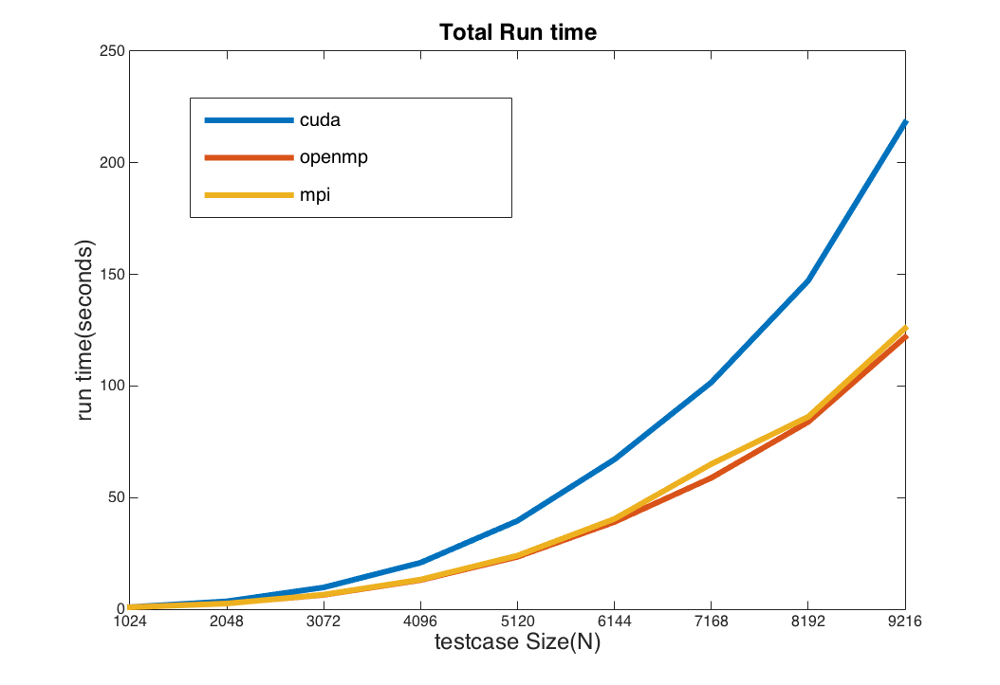

這個實驗是測量執行程式的總時間，其實可以明顯看到MultiGPU的執行時間遠大於Single GPU，而openmp 的執行時間又小於MPI，由於MPI還需要communication，把算好的資料搬到另外一個process上，所以比openmp版本的時間多上一些。由於$Floyd\ Warshall$的時間複雜度是$O(N^3)$，所以可以看到時間呈現凹向上的狀態。

### Computating time (kernel runtime)
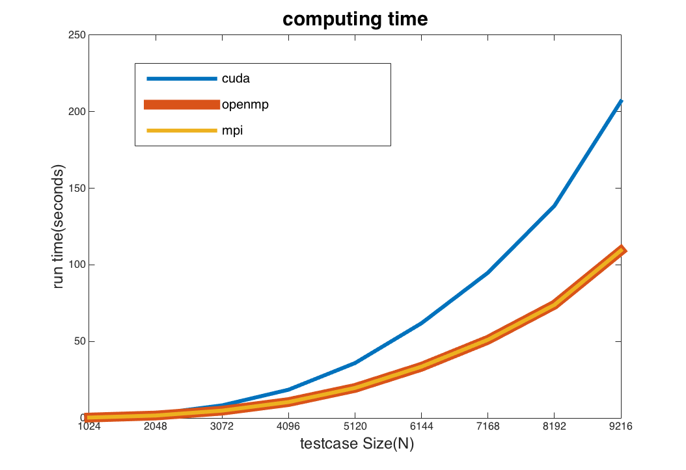

這個實驗最主要是去除其他影響計算的因素，包括malloc, memcpy, IO... 等，單純只計算CUDA kernel執行的時間。以這張圖為例，single GPU的版本基本上比multi-GPU的版本的計算時間還要來的長。然後openmp和MPI的計算時間是差不多的，但是總時間openmp和MPI有些為的落差，下面其他的實驗會探討其原因。


### Memory copy time
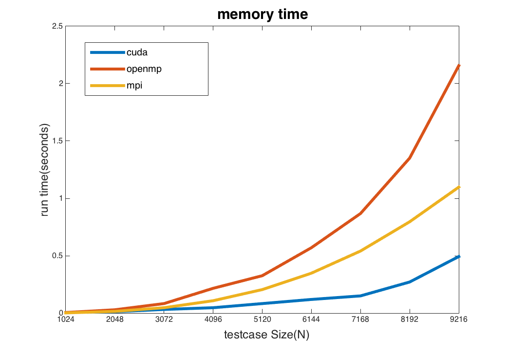

針對memcpy，***OpenMP***的copy是`DeviceToDevice`， ***MPI*** 的copy方式是先copy到host memory，然後傳到其他process後，在copy進另外一個GPU的memory。在這個實驗看到有趣的地方是，使用`DeviceToDevice` copy 的時間比MPI copy的時間還來的長，Device之間傳輸的速度似乎沒有很快。當然Single GPU只有read & write有用到memory copy，所以當然比兩個GPU cpoy的時間還來的短。

### IO time
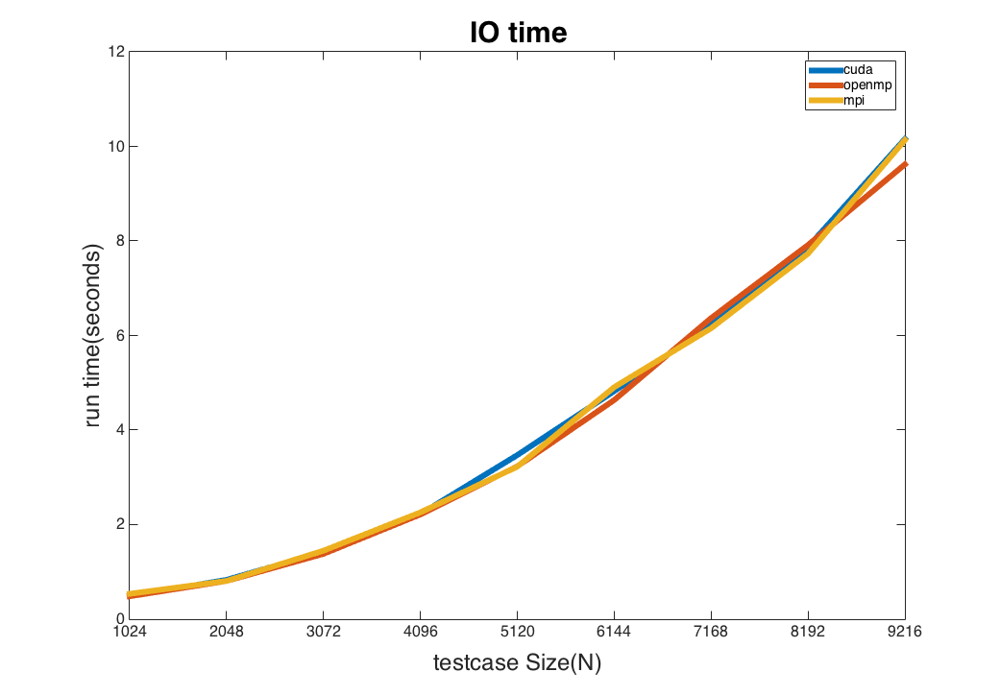

IO的話三者是差不多的，畢竟只有一開始讀檔，還有把結果寫入檔案，三者的實作方式是一樣的。

### MPI Communication time
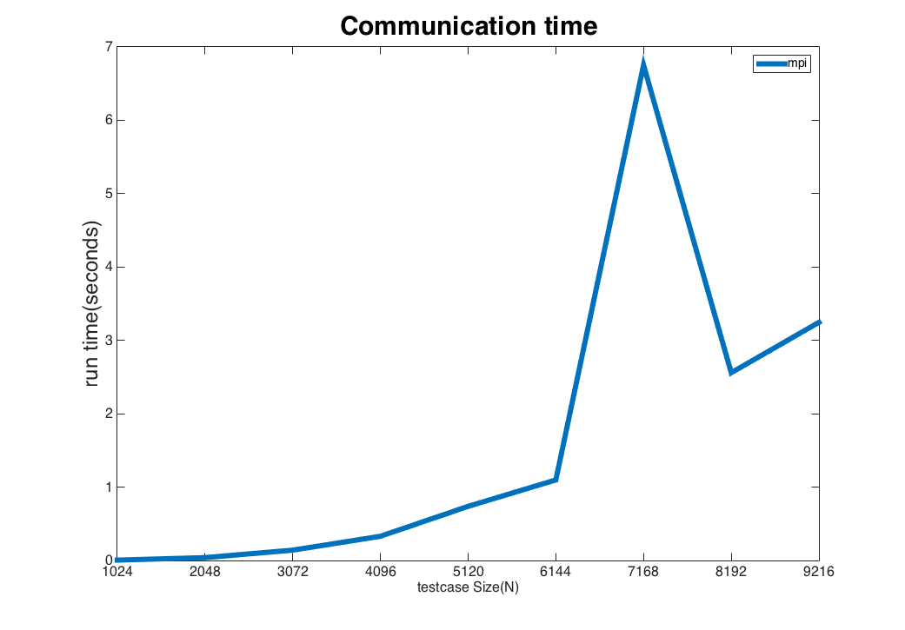

此實驗針對不同Input Size(N)，測量兩個process之間的communication，雖然理論上趨勢應該是會越來越多，但是在 N = 7168 執行時間就掉下去，在優化的版本也有類似的狀況發生，所以我猜測是因為每次傳輸資料的分配不平均，但是在某些狀況下，資料分配就很平均，所以傳輸的時間會快一點。

### Blocking Factor

#### GFLOPS
Floyd Warshall 的時間複雜度是$O(N^3)$，因此假設我們最少需要計算$N^3$次，然後我們假設下面這段code 需要$3\ flops$，而且$N=1024$：

```cpp
if (d[i][j] > d[i][k] + d[k][j])
    d[i][j] = d[i][k] + d[k][j];
```
所我以們需要的計算次數是：$GFLOPS=3 \times N^3 \div computing\ time \div 10^9$

以下是實驗結果：
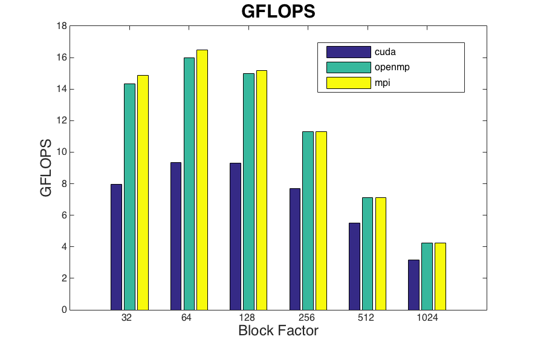

在 blocksize = 32 到 64，GFLOPS會上生，$blockSize = 64$的時候會發現到，他的GFLOPS是最大的，在之後才會繼續往下掉。

#### BandWidth

對於MPI以及OpenMP來說，Memcopy在每一個回合都需要和另外一個device溝通，每一次copy的資料量都是 N * N，然後需要做$N \div blockfactor$次，因此記方法如下：
$Bandwidth(GB/s) = N \div blockfactor * N * N \div memory\ copy\ time$

以下是實驗結果：

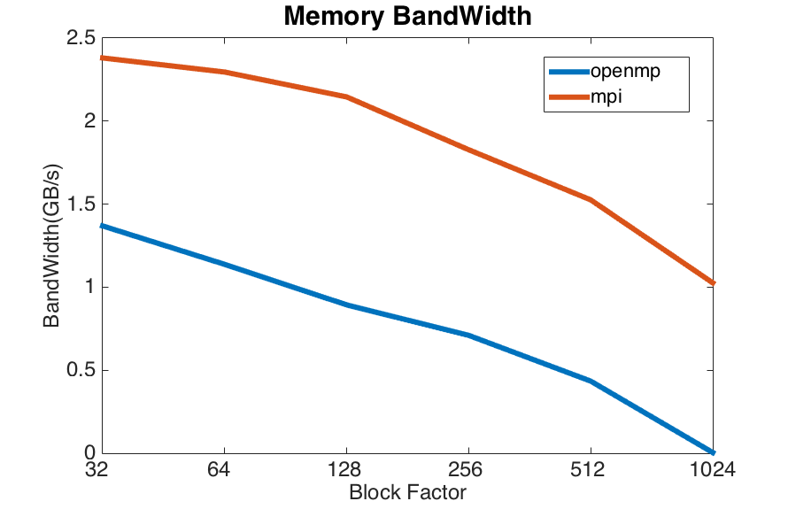

由於我memory copy 的方式是每一回合直接對整份資料切成兩半，phase 3 做完在教換彼此沒有的資料。因此當blockFactor越小的時候，呼叫$cudaMemcpy$的次數就會變的比較多，相反的blockSize較大的時候，呼叫的次數就會比較少。OpenMP採用的是DeviceTODevice的memory Copy，不過跑出來的結果卻比MPI的DeviceToHost->HostToDevice還小。當然最高的memory bandwidth 可以接近2.5GB/s。不過我認為可能是因為資料量小，才會有較大的誤差。

## Optimization

做完上述的版本之後，其實對於跑出來的效能不是很滿意，因此嘗試去做了優化，不過大多數都是在嘗試cuda block/thread之間參數的問題，這部分就不多加描述了。

前面我的profiling結果顯示，我的cudaLaunch佔了一大部分的時間，所以我嘗試優化這部分。我做完所有版本之後，回頭觀察一下演算法，發現phase 3 基本上是利用phase 2 以及phase 1的最佳解來迭代自己的答案，所以基本上不用去handle cuda block之間不能synchronize的問題，因此不用特別為了k值去synchronize所有的threads(包括不同的block)，也可以減少launch kernel的次數。優化後的版本如下圖：

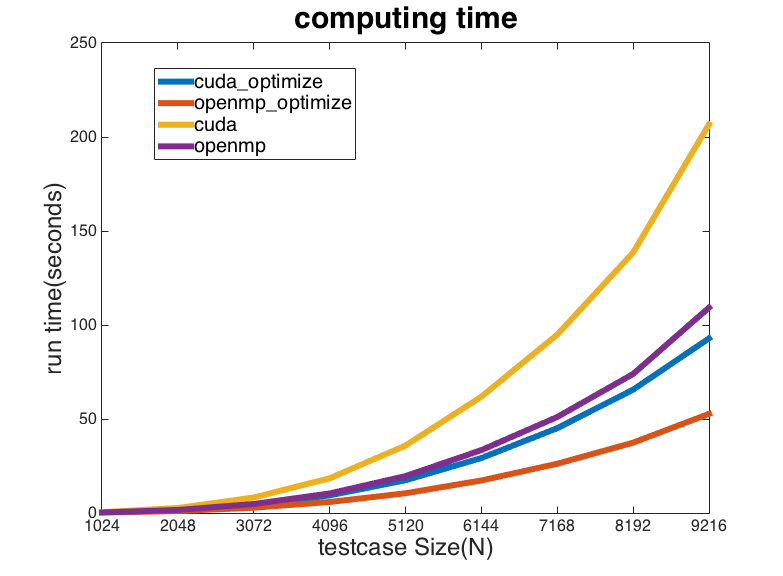

減少kernel launch 的時間就讓整個時間降了下來，甚至還比沒有優化過的openmp還快。其實也間接證明我的program的bottle neck是在kernel launch。OpenMP在極大的測資下，也可以在50秒左右跑完。