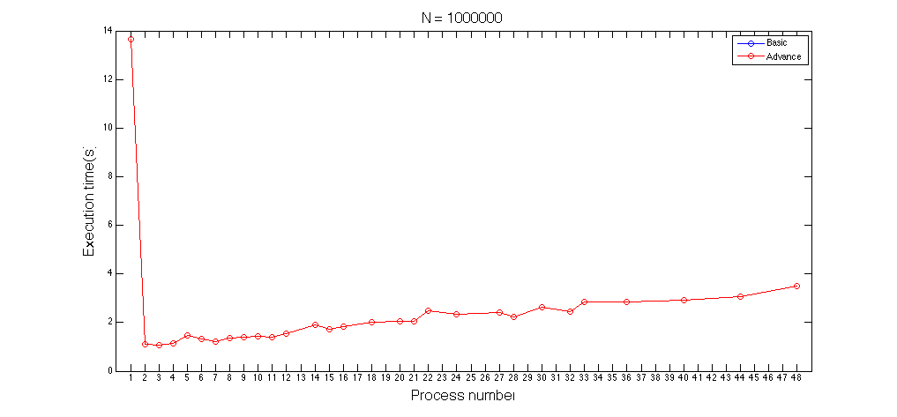

# <center> Parallel Programming </center>
###  <center> [HW1 Odd/Even Sort] 102062111 林致民

## Implementation

### Basic

Basic 版本的規則基本上就和Spec上的一樣，實作方法如下：

1. 假設我有 N 個input testcase 以及 M 個process(rank)，我對N個元素切成 M 等分，每個rank都有 $\frac{N}{M}$ 個元素，剩下的元素全部補到最後一個rank上。

2. 首先看其中一個process，$local\_size=\frac{N}{M}$，再來對元素做編號0, 1, 2, .... ,local_size-1，在偶數回合，就是(0,1)、(2,3)、(4,5) .... 一組。相反的，在奇數回合，就是(1,2)、(3,4)、(5,6)一組。如果可以交換就交換。

3. 做完交換之後，必須要處理不同process之間元素交換的問題，以下是不同process之間的交換方式：
	* 假設有兩個Process要交換，分別是 Rank & Rank + 1 
	* rank 把當前回合最後一個元素往 rank+1送
	* rank+1 收到 rank的元素，將此元素與 rank+1的第一個元素比較
		* 如果比rank+1的元素還大，這個元素把rank+1的元素替換掉，並且把rank+1原本第一個元素往rank送
		* 相反的，則直接把收到的元素送回去
	* rank 收到 rank + 1送來的元素，跟rank裡最後一個元素比較，如果元素值發生改變，就替換掉
	* 偶數回合溝通的組合：(rank 0, rank 1), (rank 2, rank 3), (rank 4, rank 5) ....
	* 奇數回合溝通的組合：(rank 1, rank 2), (rank 3, rank 4), (rank 5, rank 6) ....
4. 終止條件我有實作兩個版本，一個是發現這回合都沒有交換，就直接結束程式。而另外一個則是跑完testcase數量結束，因為odd/even sort 最糟糕的情形是，一個元素從最右邊換到最左邊。會設計兩種實作方式的原因是，我認為一直去檢查每個process到底有沒有交換，這件事情會影響到執行效率。終止條件設立的初衷是要減少計算量，但是每一回合去通知所有process，基於MPI的Communication Overhead都會在作業系統，我並不覺得這是個有效率的做法，因此實作一個跑Ｎ回合就停止的版本來作比較。  

5. 把所有的元素用搜集到同一個process，並且輸出檔案。

### Advanced

Advanced 的做法是採用Quicksort + Merge 的方式，實作方法如下：

1. 假設我有 N 個input testcase 以及 M 個process(rank)，我對N個元素切成 M 等分，每個rank都有 $\frac{N}{M}$ 個元素，剩下的元素全部補到最後一個rank上。

2. 每個rank 各做自己的QuickSort

3. 假設有兩個process Rank_0 Rank_1 要merge，merge的方法就是採用merge sort的合併方式，程式碼如下：
	
	```cpp
	// recv_buf 是從其他process 接收來的元素
	// recv_len 是從其他process 接收來元素的個數
	// local_arr 是當初分配元素到其他rank sort好的結果
	// num_per_node 是一個process 分配到的元素個數
	// send_buf 則是把 recv_buf 和 local_arr merge完的結果
	int i = 0, j = 0, cur = 0;
	while (i < recv_len && j < num_per_node) {
    // Do MERGE array 
   		if (recv_buf[i] < local_arr[j]) {
       	send_buf[cur++] = recv_buf[i++];
    	} else {
        	send_buf[cur++] = local_arr[j++];
    	}
	}
	while (i < recv_len)
   	 	send_buf[cur++] = recv_buf[i++];

	while (j < num_per_node)
    	send_buf[cur++] = local_arr[j++];
	```

3. 從Rank 0 開始往 Rank_1 Merge，Rank_1 繼續往 Rank_2 Merge，直到最後一個Rank。

4. 最後一個rank則是sort好的element

## Experiment & Analysis

### System Environment & Time Measurement 

執行程式的環境是使用課程提供的Cluster，而測量時間是用linux 提供的time 指令。

### Performance mesurement

* 相同Process的效能趨勢：對於相同process數($nodes \times ppn$)，看執行時間的趨勢，預期是越多process，他的執行時間會越少。對於這個執行時間的量測方法採用『幾何平均』。也就是說，如果多個相同process數量的數據，看有幾組，就對這幾組數據的乘積開幾次方根。（藍色線是Basic Version，紅色線是Advanced Version）

	**N = 100000**

	
	
	* 對於Advanced Version來說，N=100000 的資料量或許太小，根據我的實作方式，我猜測時間的增加會是大量操作memory所造成的現象。
	* 而Basic version可以很明顯的從圖表上看出，當process數目多一點的時候，他的執行時間會越短。
	* 當 Basic Version 的process 數量增加到一定的程度，他的執行時間就降不下去 
	* 兩者的執行時間會越來越接近，process數量再多一點，或許有機會反超

	**N = 1000000**
	

	
	以下這個是紅線放大圖：
	
	
	* Basic Version 的process 數量大幅影響執行時間
	* Advanced Version 當process變成兩個執行時間變短，其他都是短幅度上升
	* Advanced Version 執行時間遠小於Basic Version
* Advanced Version 不同資料量，繪製出來的圖形，分別使用不同N的input testcase：
	
	
	* 資料表示分別為：粉紅(N=84000000)，黑色(N=10000000)，紅色(N=1000000)，藍色(N=100000)
	* 從一個process變成兩個process執行時間繪圖飛猛降
	* Process 數目越多，執行時間不降反增
	
* 比較「每回合判斷所有process是否有元素交換」與「直接跑Ｎ次」。這個比較目的是，理論上前者會把不必要的case判掉，當前的狀態已經全部比較完畢，應該要比後者提早結束。但是當隨機測試資料作為input，前者是否會比後者有效率？以下是跑出來的結果（藍色的為後者，紅色的為前者）

	**N = 1000000**
	
	
	
	* 發現到，每一次都檢查到底有沒有交換，在隨機測試資料下，執行時間並不會比跑完
	* 每一次檢查，process 之間就需要溝通，只要是溝通就會造成很大的時間延遲。
	
* 相同Process數量，比較Node個數、資料量不同而影響的Communication Time。

	假設Process數量都是 12
	
	**Basic Version**
  
	| node | ppn |  Execution Time(s) N = 100000 | Execution Time(s) N = 1000000 |
	|:----:|:---:|:-----------------------------:| :----------------------------:|
	|   1  | 12  |              2.31             |  159.076   |
	|  2   |  6  |              2.574            |  160.024   |
	|  3   |  4  |              2.423            |  158.732   |
	|  4   |  3  |              2.399            |  159.15    |
		
	**Advanced Version**
  
	| node | ppn | Execution Time(s) N = 100000 | Execution Time(s) N = 1000000  |
	|:----:|:---:|:-----------------:| :-----------:|
	|  1   | 12  |      0.718      |  0.768 | 
	|  2   |  6  |      0.927      |  1.006 |
	|  3   |  4  |      0.788      |  0.852 |
	|  4   |  3  |      0.712      |  0.786 |

	或許是Infiniband 太強大，在Communication Time 看不出顯著的差距，在Advanced Version的資料量，但是其實都有個共同的現象：把process集中在某個node的執行時間都會比較少。

* 以下是原始資料用圖表的方式呈現：

	**Basic Version**


	**Advance Version**


